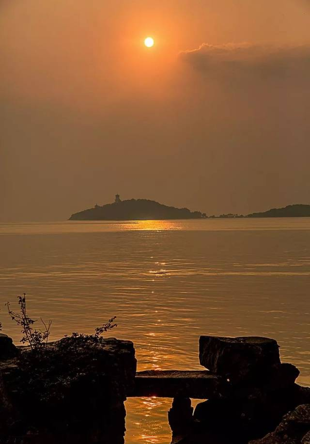
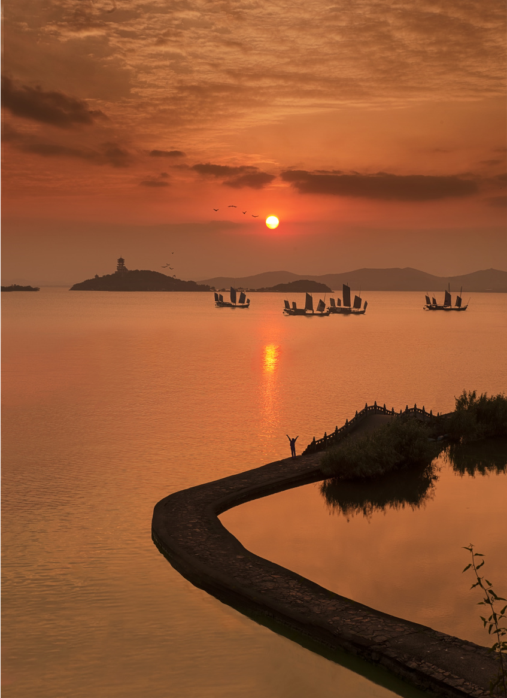
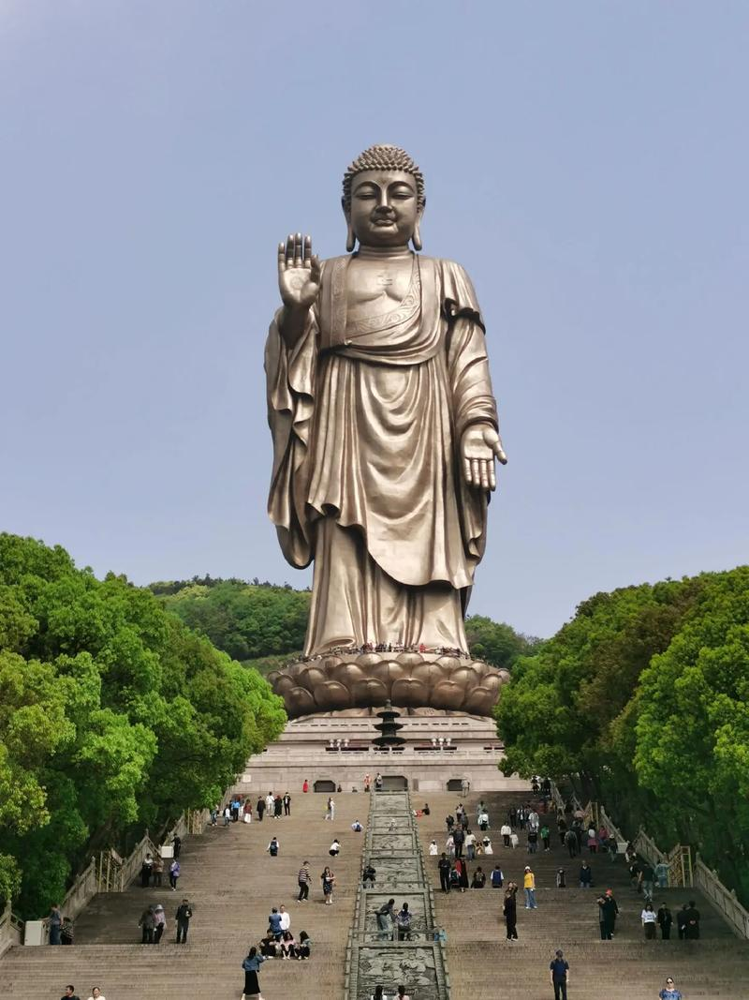

# Wuxi

{width=100%}

Wuxi is a city in Jiangsu Province, known for its beautiful scenery and rich culture.

---

## 🌿 Taihu Lake

{width=100%}

Taihu Lake is one of the largest freshwater lakes in China and a symbol of Wuxi.

---

## 🏯 Lingshan Buddha

{width=100%}

The Lingshan Grand Buddha is one of the tallest Buddha statues in the world.

---

## 🍜 Local Food

{width=70%}

Wuxi cuisine is famous for its slightly sweet taste.  
Popular dishes include spare ribs and soup dumplings.